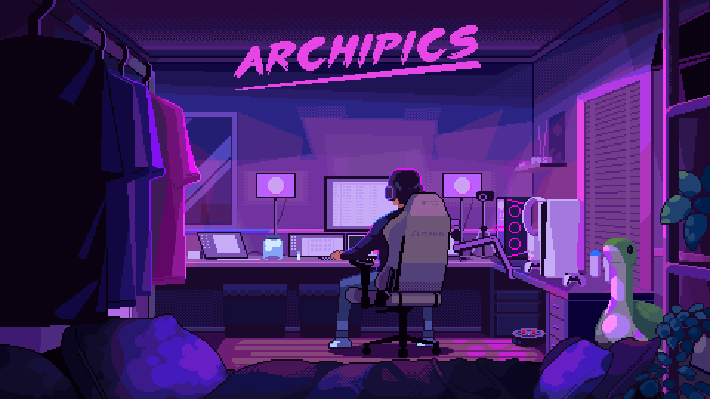

### Hi there 👋
<!--
**SHIBAMMOHANTY/SHIBAMMOHANTY** is a ✨ _special_ ✨ repository because its `README.md` appears on your GitHub profile.
-->

  
  <h1>Hi, I'm Shibam Mohanty</h1>
  
<strong>A Passionate Full Stack Web & Blockchain Developer From India</strong>

  
🔭 Currently building: <strong>Coding School</strong>

  
🌱 Learning: <strong>Web Development, Blockchain, and more</strong>

  
📝 I write tech blogs: <a href="http://tgvirusgamingofficial.blogspot.com/" target="_blank">tgvirusgamingofficial.blogspot.com</a>

  
📫 Reach me: <strong>shibammohanty8658@gmail.com</strong>

  
⚡ Fun fact: <strong>I think I'm funny ☺</strong>

  
  

    
  

   
  

 

### 🌐 Connect With Me

  
  
  
  
  
  
  
  
  
  
  
  
  
  

 

### 💼 Languages & Tools

  
  
  
  
  
  
  
  
  
  
  
  
  
  
  
  
  
  
  
  
  
  
  
  
  
  
  
  
  
  

 

### 📊 GitHub Stats

  
  

 

  

 

### 💖 Support Me

  
  

 

  

